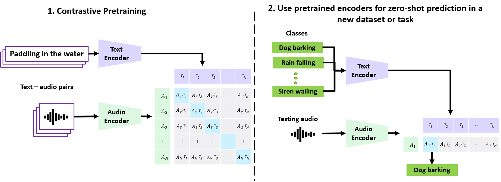

# CLAP👏

## 参考
* [CLAP: Learning Audio Concepts From Natural Language Supervision
](https://arxiv.org/abs/2206.04769)
* [Large-scale Contrastive Language-Audio Pretraining with Feature Fusion and Keyword-to-Caption Augmentation](https://arxiv.org/abs/2211.06687)

## 概要
* CLIPを音声データに応用したもの
* 音とテキストとをそれぞれエンコーダで埋め込み、対照学習を用いることで、マルチモーダル空間での音とテキストの対応を学習している

## モチベーション

### 音へのラベリング
学習に音と対応するテキスト（自然言語）を使い、単一モデルで任意の語彙を扱えるようにすることで、従来の音分類においてボトルネックだった、大量の人手ラベルが必要な点やカテゴリが事前に固定されてしまっているといった点を解消しようとしている

### マルチタスク・ゼロショット対応
環境音分類や音楽ジャンル判定といった下流タスクに対して、追加学習なしに行える汎用的な表現の獲得を狙っている

### 適用タスク
下記のようなタスクへの適用が考えられる。

| タスク                 | 典型的ユースケース                                 | CLAP の利点               |
| ------------------- | ----------------------------------------- | ---------------------- |
| **ゼロショット音タグ付け**     | 未知クラスの環境音を「chainsaw」「meowing」など自由語彙でラベリング | プロンプトで任意単語を指定できる       |
| **テキスト→音検索**        | 「雨音が弱まっていくサウンド」を検索して効果音を探す                | クエリ文をエンコードするだけでランキング可能 |
| **音→テキスト検索／キャプション** | 音声ファイルに最適な説明文を付与しメタデータ補完                  | 埋め込み近傍の文をそのままキャプションに   |
| **マルチモーダル統合**       | 映像・画像・音を同時に扱う AV タスク                      | 同じ言語空間に揃うため統合が容易       |

## メソッド

### 流れ
* 音-テキストペアデータを使用して学習する
* 音とテキストをそれぞれのエンコーダで埋め込み表現に変換する
  * 厳密には音はログメルスペクトログラム画像データとして表現されており、それが埋め込まれる
* 埋め込みを線形射影してマルチモーダル空間に持っていく
* 対照学習により、似ているもの同士は近く、似ていないものは離れるように、エンコーダと線形射影、温度パラメータを学習
* 学習後は、事前学習済みエンコーダ及び射影層、温度パラメータの下で、音とテキストのzero-shot分類がなされる

*CLAPのイメージ。https://arxiv.org/abs/2206.04769 より引用。*

### 音-テキストの対照学習
学習用の音-テキストペアデータセットを $\mathcal{D}=\{X_a,X_t\}_{i=1}^N$ とする。
$X_a\in\mathbb{R}^{F\times T}$ は音データ（ログメルスペクトログラム画像データ）で、 $F$ と $T$ はそれぞれスペクトル要素の数（周波数方向のbin数）と時間ステップ（時間方向のbinの数）を表す。
$X_t$ はテキストデータを表す。

音とテキストデータはそれぞれ音エンコーダ $f_a$ とテキストエンコーダ $f_t$ を通って埋め込みに変換される:

$$
\begin{cases}
    \hat{X}_a=f_a(X_a)\in\mathbb{R}^{N\times V}\\
    \hat{X}_t=f_t(X_t)\in\mathbb{R}^{N\times U}
\end{cases}
$$

$V$ と $U$ はそれぞれ音埋め込みとテキスト埋め込みの次元の数であり、一般に $V\neq U$ である。

これら埋め込みの次元を揃えてマルチモーダル空間で扱うために、次の線形射影によって次元 $d$ のマルチモーダル空間へ飛ばす:

$$
\begin{cases}
    E_a=L_a(\hat{X}_a)\in\mathbb{R}^{N\times d}\\
    E_t=L_t(\hat{X}_t)\in\mathbb{R}^{N\times d}
\end{cases}
$$

$L_a$ と $L_t$ はそれぞれ音とテキストの線形射影であり、学習対象である。
簡単の為、以降は $E_a$ と $E_t$ をそれぞれ音の埋め込み、テキストの埋め込みと呼ぶこととする。

$E_a$ と $E_t$ は同一次元を持つので類似度が計算できる:

$$
C = \tau(E_a\cdot E_t^\mathsf{T})
    =\tau
    \begin{bmatrix}
        E_{a 11} & \cdots & E_{a 1d}\\
        \vdots &  & \vdots  \\
        E_{a N1} & \cdots & E_{a Nd}\\
    \end{bmatrix}
    \begin{bmatrix}
        E_{t 11} & \cdots & E_{t N1}\\
        \vdots &  & \vdots  \\
        E_{t 1d} & \cdots & E_{t Nd}\\
    \end{bmatrix}
$$

ここで $\tau$ は（逆）温度パラメータで学習対象である（ログでスケーリングする）。
$C\in\mathbb{R}^N\times N$ は類似度行列で、 $N$ 個の正解ペアを対角にもち、 $N^2-N$ 個の不正解ペアを非対角成分に持つ。
正解ペアの類似度が高く、不正解ペアの類似度が低くなるようにエンコーダと射影、温度を学習する。

CLAPでは、類似度行列 $C\in\mathbb{R}^{N\times N}$ に対して、テキスト軸と音軸の2方向から InfoNCEロスを計算し、平均したものを最終損失とする：

$$
\mathcal{L}=\frac{1}{2}(\ell_{\text{text}}(C)+\ell_{\text{audio}}(C))
$$

ここで、 $\ell\_{\text{text}}(C)$ はテキスト軸損失で次式で与えられる:

$$
\ell_{\mathrm{text}}(C)
= -\frac{1}{N}\sum_{i=1}^{N}
  \log
  \biggl(
    \frac{\exp(C_{ii})}{\sum_{j=1}^{N}\exp(C_{ij})}
  \biggr)
$$

各行 $i$ について、正例が列 $j=i$ の要素に対応する。
$C_{ij}$ のソフトマックスを取った後の確率をクロスエントロピーで評価する。

同様に $\ell\_{\mathrm{audio}}(C)$ は音軸損失で次式で与えられる:

$$
\ell_{\mathrm{audio}}(C)
= -\frac{1}{N}\sum_{i=1}^{N}
  \log
  \biggl(
    \frac{\exp(C_{ii})}{\sum_{j=1}^{N}\exp(C_{ji})}
  \biggr)
$$

この損失関数を最小化するように学習を進めることで、正例ペアの類似度は高く、不例ペアの類似度は低くなるようになる。

ここから具体的にそのことを見ていく。

### 最適解における類似度行列の形

表記を簡単にするため、次の表記を使う: 

$$
C_{ij}=\tau S_{ij}=\tau E_{a i}\cdot E_{\tau j}\,,
\\
p_{ij}=\frac{\exp(C_{ij})}{\sum_{j=1}^N \exp(C_{ij})}\,.
$$

埋め込み $E_{a i}, E_{t j}$ の大きさは $\tau$ に吸収できるので、以降では $\| E_{a i}\|=\| E_{t j}\|=1$ とする。

損失関数の $C_{ij}$ での勾配が0になるような $C_{ij}$ ないし $S_{ij}$ の表式を見れば良い。
簡単な計算により

$$
\frac{\partial\mathcal{L}}{\partial C_{ij}}
\propto (-\delta_{ij}+p_{ij})
$$

であるから、 $\partial\mathcal{L}/\partial C_{ij}=0$ より、 $p_{ij}=\delta_{ij}$ 、すなわち、

$$
p_{ii}=1,\, p_{ij}=0\,(i\neq j)\,.
$$

よって、最適解としては類似度行列について

$$
C_{ii}\gg C_{ij}\, (i\neq j)
$$

である必要がある。
また、 $C_{ij}=\tau S_{ij}, \|S_{ij}\|\ll 1$ なので、
 $S_{ii}\gg S_{ij}\,(i\neq j)$ から $S_{ii}$ はその上限値である $1$ をとって欲しいとなる。
したがって、最適解においては

$$
1=S_{ii}\gg S_{ij}\, (i\neq j)
$$

となる。

これからわかるように、対応する音-テキストペアの類似度は高く、それ以外は低くなるように学習が進む。

## 論文別エンコーダモデル一覧

各文献/モデルで用いられている音エンコーダ、テキストエンコーダの種類、出力次元、投影後次元をまとめた。

| 文献/モデル                              | モダリティ | エンコーダ                     | 出力次元 (Encoder) | 投影後次元 |
| ------------------------------- | ----- | ------------------------- | ----------------- | ----- |
| LAION-AI CLAP v1.0 (2022)       | Audio | HTSAT (Swin-Transformer系) | 768               | 512   |
|                                 | Text  | RoBERTa-base              | 768               | 512   |
| arXiv:2211.06687 (大規模比較)     | Audio | PANN CNN14                | 2048              | 512   |
|                                 | Audio | HTSAT                     | 768               | 512   |
|                                 | Text  | CLIP Transformer          | 512               | 512   |
|                                 | Text  | BERT-base                 | 768               | 512   |
|                                 | Text  | RoBERTa-base              | 768               | 512   |
| arXiv:2206.04769 (CLAPオリジナル) | Audio | PANN CNN14                | 2048              | 1024  |
|                                 | Text  | BERT-base                 | 768               | 1024  |
